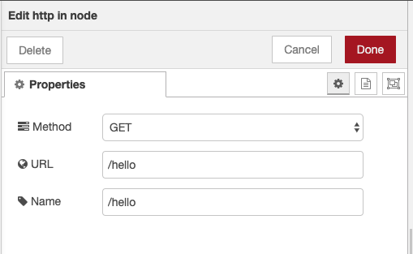
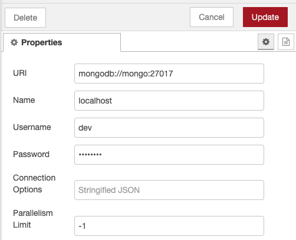
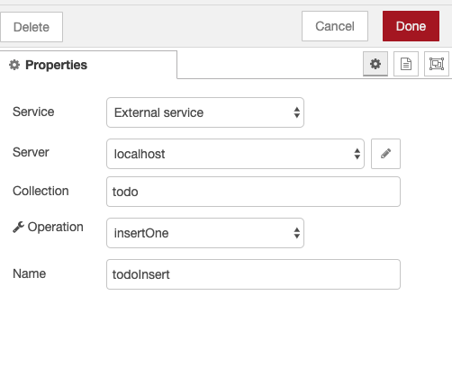

# Welcome in the node-red workshop !

## Short presentation

TODO

## Installation (node-red)

- Clone this repository & move into the directory
- start docker `docker-compose up` (it will run node-red & mongodb)

source: https://nodered.org/docs/getting-started/local

## Security (source : https://nodered.org/docs/user-guide/runtime/securing-node-red)

By default, the Node-RED editor is not secured - anyone who can access its IP address can access the editor and deploy changes.

Let's securise it !

You will need to edit the `settings.js` in the `.node-red` folder...

If you want to go in this folder, you will need to run the cmd in the docker container:

- get the container id with : `docker ps`
  

- run the bash of the container : `docker exec -it <container id> /bin/bash`

- Welcome in the bash of the contrainer

- generate a password and copy the result : `npx node-red-admin hash-pw` (Don't forget to kill it ! You will get something like this : "$2a$08\$71Vr0fW17O1Jl1BzfA7NGOYO6dSSANyZBwLxdr0QFd..0O3ihpzoS")

- Edit the `settings.js` file : `vi /data/settings.js`

- Welcome in hell... (vim), go near the line 123, you will find a `adminAuth` object, just uncomment with the `X` key (or press `I` to get the `insert mode`) (uncomment line 123 -> 130)

- With the insert mode change the password by the password you generated earlier

- quit & save vi (`ESC + :wq` or `ESC + maj + ZZ`)

- if you want to leave the docker container bash : `ctrl + D`

- turn off docker (`ctrl + C`), restart docker (`docker-compose up`)

## Installation (mongodb)

- install MongoDB Compass (https://www.mongodb.com/download-center/compass)

- connect to the local database (user: dev & password: dev)
  

## Getting start

Node-red is setup and "securised" !

You can go on this page : `http://127.0.0.1:1880/`

### Hello world

- First drag-&-drop from the palette `inject` and `debug` into the workspace

- Wire `inject` to `debug`

- Double click on `inject` and change his value (modify `timestamp` to `string` for example)

- Click on `deploy` (on the top right corner) & click on the button on the left of `inject`. You will see in the `debug tab` (on the top right corner) the value of `inject`
  

### what have we done ?

`inject` node to "inject" information/variable in the **flow**

### Structure des informations

If you look at the debug button (named : `msg.payload`), you can see it return the content of `msg.paylaod`.

Node red use the playload object to pass variable between nodes.

### switch & change & template

The `switch` node is like a "if", if the condition in the node isn't good, it won't let it pass.

The `change` node is like a `=` in js, it change a value.

The `template` node just "format" a response and return a string.

In this example:

- first I put a `inject` to inject a value in the flow (value : 5)
- then I check with a `switch` if the value is `<= 5` or `< 5`
- after the `switch` I use a `set` node to modify the payload to "failed" or "sucess" (it depend of the switch)
- finaly I format the string with a `template` node
- (last node is a console.log)

## Api time !

Basically, node-red already have everything you need to connect the client & the server.

In the network block of the palette, you will find `http in`, `http response`, `http request` and more other network things...

But there is no node aboud database. The next step will help to install "new" node to manage your database (mongodb in this case)

### Setup

- first you will need to install mongodb2 (2 because the first version isn't really complete) in node-red

- click on the menu icon in the top right of the window and click in `settings`  
  

- in the `user settings` popup, click on `Palette` and on the `install` tab
  

- search for `mongodb2` (`node-red-contrib-mongodb2`) and install it

- you'll need to install `node-red-contrib-objectid`, it will help you to search by the id of the object in the database/collection

- after the installation you should find a `mongodb2 in` in your nodes (in the storage bock) and an `objectid` node (in the function bock)

### Hello world (api - get /hello)

- drag&drop a `http in` node and edit his proteries
  

- drag&drop a `http response`

- place a `template` node between them and edit it to return "hello world"

You should have something like this:

- try in your natigator : http://127.0.0.1:1880/hello, you should see `Hello world`

### Use mongodb node

#### Setup mongodb settings

- drag&drop a `mongodb2 in` from the palette to the workspace
- edit it
  - edit the server to get this (user :dev, password dev)
    
- First step: we will insert a todo in the database in the collection `todo` so in the collection field of mongodb2 just write `todo` and change to operation to get `insertOne`  
  

- now you can add a `http in` node and configure it as `post` and for the `/newUser` ("verification" just mean, if you want to do a real api, you should put some condiction there) 
  
