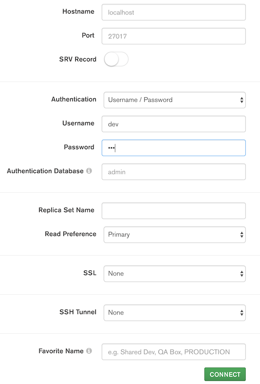
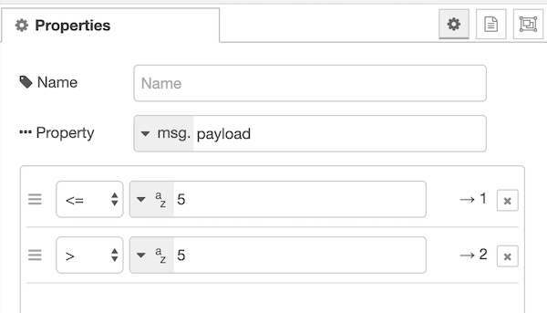
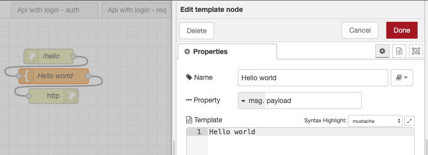
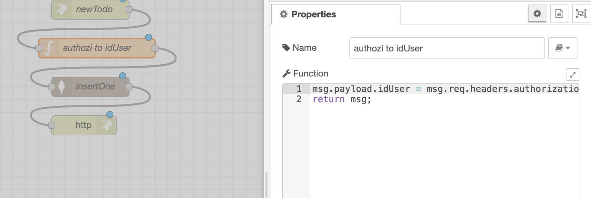
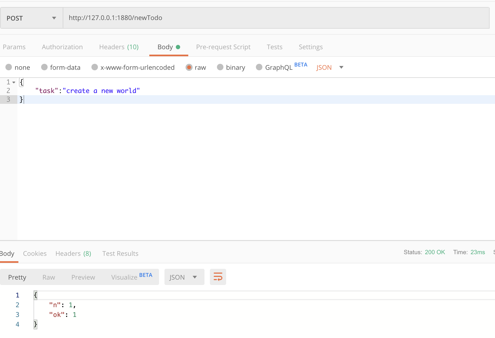
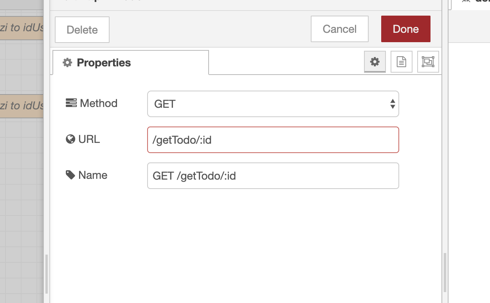
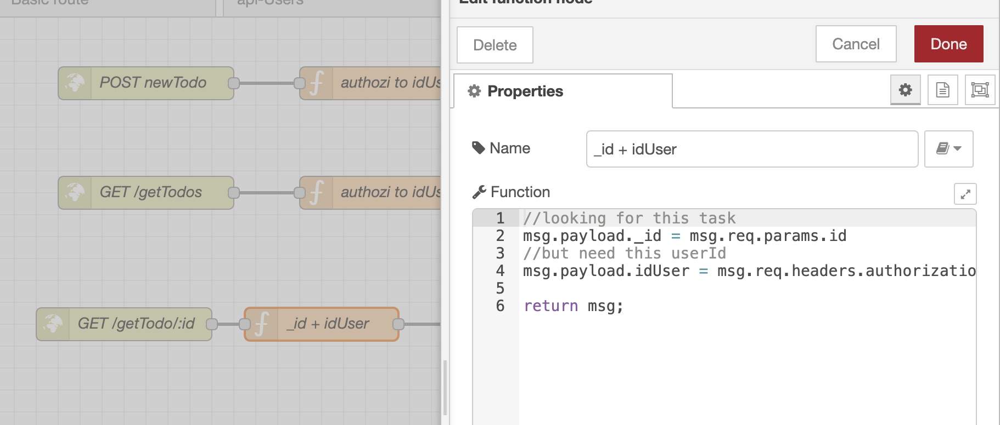
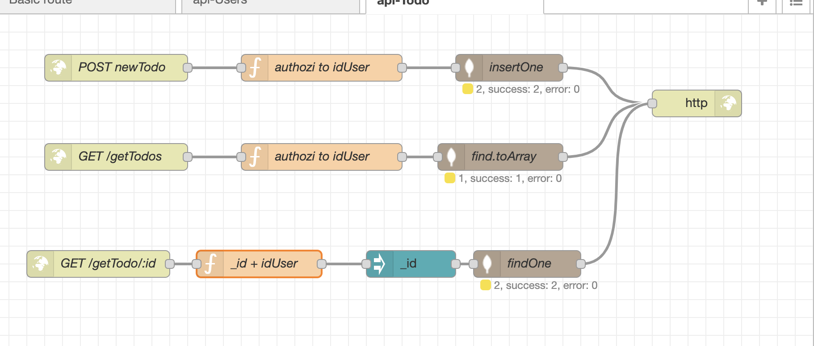

# Welcome in the node-red workshop !

## Short presentation

TODO

## Objectives

At the end this workshop, you should be able to create a simple api with node-red
Simple means you will be able to create a register/login, create task(s) attribute to one user.

## Installation (node-red)

- Clone this repository & move into the directory
- start docker `docker-compose up` (it will run node-red & mongodb)

source: https://nodered.org/docs/getting-started/local

## Security (source : https://nodered.org/docs/user-guide/runtime/securing-node-red)

By default, the Node-RED editor is not secured - anyone who can access its IP address can access the editor and deploy changes.

Let's securise it !

You will need to edit the `settings.js` in the `.node-red` folder...

If you want to go in this folder, you will need to run the cmd in the docker container:

- get the container id with : `docker ps`
  

- run the bash of the container : `docker exec -it <container id> /bin/bash`

- Welcome in the bash of the contrainer

- generate a password and copy the result : `npx node-red-admin hash-pw` (Don't forget to kill it ! You will get something like this : "$2a$08\$71Vr0fW17O1Jl1BzfA7NGOYO6dSSANyZBwLxdr0QFd..0O3ihpzoS")

- Edit the `settings.js` file : `vi /data/settings.js`

- Welcome in hell... (vim), go near the line 123, you will find a `adminAuth` object, just uncomment with the `X` key (or press `I` to get the `insert mode`) (uncomment line 123 -> 130)

- With the insert mode change the password by the password you generated earlier

- quit & save vi (`ESC + :wq` or `ESC + maj + ZZ`)

- if you want to leave the docker container bash : `ctrl + D`

- turn off docker (`ctrl + C`), restart docker (`docker-compose up`)

## Installation (mongodb)

- install MongoDB Compass (https://www.mongodb.com/download-center/compass)

- connect to the local database (user: dev & password: dev)
  

## Getting start

Node-red is setup and "securised" !

You can go on this page : `http://127.0.0.1:1880/`

### Hello world

- First drag-&-drop from the palette `inject` and `debug` into the workspace

- Wire `inject` to `debug`

- Double click on `inject` and change his value (modify `timestamp` to `string` for example)

- Click on `deploy` (on the top right corner) & click on the button on the left of `inject`. You will see in the `debug tab` (on the top right corner) the value of `inject`
  

### what have we done ?

`inject` node to "inject" information/variable in the **flow**

### Structure des informations

If you look at the debug button (named : `msg.payload`), you can see it return the content of `msg.paylaod`.

Node red use the playload object to pass variable between nodes.

### switch & change & template

The `switch` node is like a "if", if the condition in the node isn't good, it won't let it pass.

The `change` node is like a `=` in js, it change a value.

The `template` node just "format" a response and return a string.

In this example:



- first I put a `inject` to inject a value in the flow (value : 5)
- then I check with a `switch` if the value is `<= 5` or `< 5`
- after the `switch` I use a `set` node to modify the payload to "failed" or "sucess" (it depend of the switch)
- finaly I format the string with a `template` node
- (last node is a console.log)

## Api time !

Basically, node-red already have everything you need to connect the client & the server.

In the network block of the palette, you will find `http in`, `http response`, `http request` and more other network things...

But there is no node aboud database. The next step will help to install "new" node to manage your database (mongodb in this case)

### Setup

- first you will need to install mongodb2 (2 because the first version isn't really complete) in node-red

- click on the menu icon in the top right of the window and click in `settings` <br>
  

- in the `user settings` popup, click on `Palette` and on the `install` tab
  

- search for `mongodb2` (`node-red-contrib-mongodb2`) and install it

- you'll need to install `node-red-contrib-objectid`, it will help you to search by the id of the object in the database/collection

- after the installation you should find a `mongodb2 in` in your nodes (in the storage bock) and an `objectid` node (in the function bock)

### Hello world (api - get /hello)

- drag&drop a `http in` node and edit his proteries
  

- drag&drop a `http response`

- place a `template` node between them and edit it to return "hello world"

You should have something like this:


- try in your natigator : http://127.0.0.1:1880/hello, you should see `Hello world`


### Register & login (+setup mongodb connection)

- drag&drop a `mongodb2 in` from the palette to the workspace
- edit it
  - edit the server to get this (user :dev, password dev)
    
- First step: we will insert a todo in the database in the collection `todo` so in the collection field of mongodb2 just write `todo` and change to operation to get `insertOne` <br>
  

- now you can add a `http in` node and configure it as `post` and for the `/newUser` ("verification" just mean, if you want to do a real api, you should put some condictions there)<br>
  
  if you want to check the result you can test your route with [postman](https://www.getpostman.com/). If you don't know how to use postman just click [here](./howtousepostman.md) !

- now let's login, use the same parten as `newUser` but with `findOne` and not `insertOne` <br>
  
  How do `fineOne` and `insertOne` work ? <br>
  It's very simple: when you call `insertOne` it will put in the database all the `payload` object ! So if you put the "email" and the "password" in body of your http request, it will put the "email" and the "password" in the database. (It only work with mongodb).<br>
  What about `findOne` ?<br>
  `findOne` will check every document of you collection and check if all properties of the `payload` (and his value) is in a document of the collection.

  If `findOne` doesn't have a match, it will just return `null`

- Try it with postman ! Normaly the return of `register` should be like this:

```
{
    "n": 1,
    "ok": 1
}
```

- and the result of `login`should be like this:

```
{
    "_id": "5dd5a491c1d8080010bd0992",
    "email": "plow",
    "pw": "plow"
}
```

Now keep this `_id`, it will be usefull in your next request with postman, we will use it as "login token".

**Good job you just finished the login part !**


If you have any question about this part, just ask them :)

### Create a task (insert again)

Ok, insert something is easy now, you know how to do it ! But we will make it bit more complicated. if you don't specify anything, every user will see every task... And we don't want it...

Earlier, I told you to save the `_id` of the user when you did the `login` request with **postman**. It's time to use it now.

In postman just place this `_id` in a new headers called `Authorization` like this: <br>


- To create a task and assign it to a user, you will need a `http in` node, `http response` node, `mongodb2 in` node (with `insertOne`) and... a `function` node !<br>
  In fact, you will need to write few code lines... <br>
  But what will we do and what will we write ?<br>
  We need to find the id in the header (`msg.req.authorization`) and put it in the `idUser` property in the `msg.payload` <br>
  
  Test in **postman** without forget to write the `authorization` in the `headers` tab <br>
  

### Find all task of a user

Find all task from a user is like the previous one but with a `find.toArray` and not ~~`insertOne`~~ <br>


### Find a task by his id (and only if the user get it!

In **mongodb**, the `_id` isn't a string so we have to transforme it into a `ObjectId` to do this, you installed `objectid` node. It convert the `msg.payload._id` (string) to `msg.payload._id` (object) !

Don't worry, I will help you !

Like the 2 previous one, you will need to use a `http in` but you need to put `:id` at the end. It means this route have a "paramater" (like a variable)


Now we need to put the `id` and the `userid` in the `msg.payload` object to do a query. <br>


Now we need to convert the `_id` (string) to `_id` (objectid) with the `objectid` node (in the function block) <br>


## You did it !

Good job ! You did it ! <br>
You did 80% of a CRUD API, the 20 others percents are the delete/modify routes and few verification for the security or things like "You can't have 2 sames email"... <br>

# The biggest question is...


