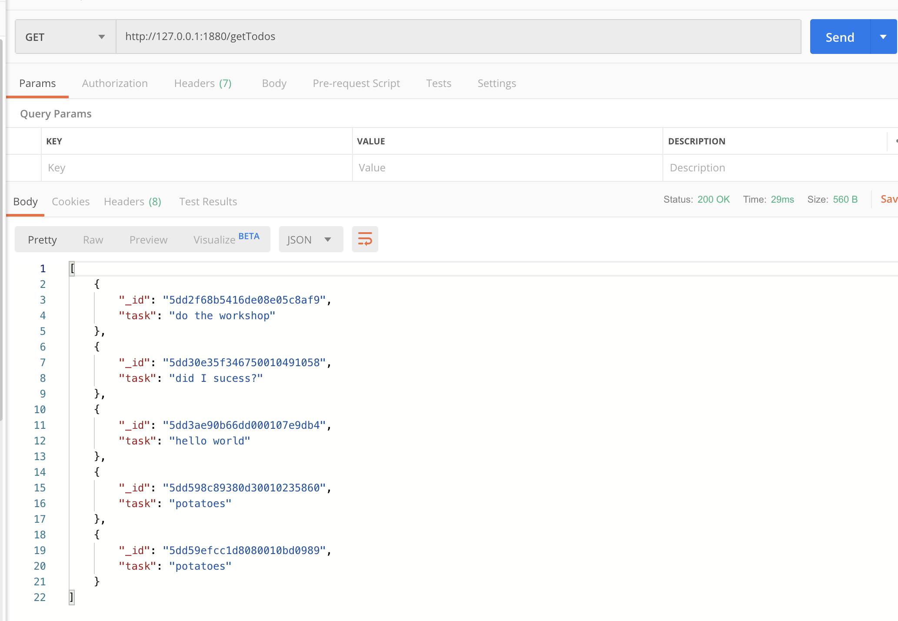
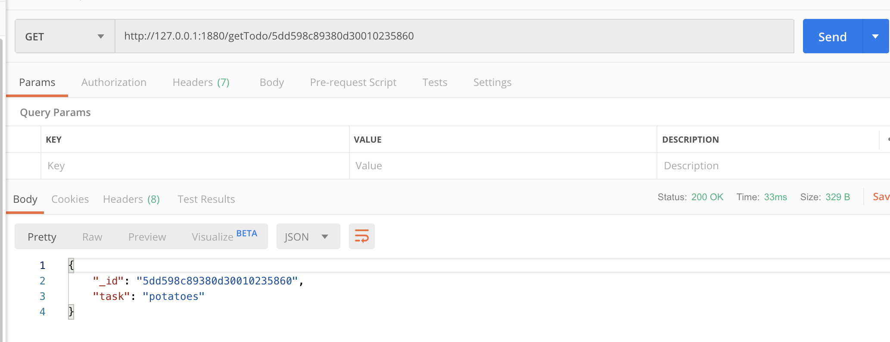

# Welcome in the node-red workshop !

## Short postman intro

Postman is a software that help you to test your api.

## Test a GET (without paramaters)

- in the field next the `GET` just write the url of the api and click on `send` to do the request  
  

  other example where I want to get all todos
  

## Test a GET (with paramaters)

- in the field next the `GET` just write the url of the api, add a `/` and a value and click on `send` to do the request.  
  In this example, I'm looking for a particular task.  
  

## Test a POST

- in the headers tab, you will need to insert a new line : `Content-Type` and `application/json`. It means : "you will send a JSON".  
   

(don't worry if the url of the request change, I just change my mind when I did the screenshot)

- in the body tab, you will need to check the `row` circle and write few line of JSON like the example  
    
  (you would get a other result if you used it with the login route)
